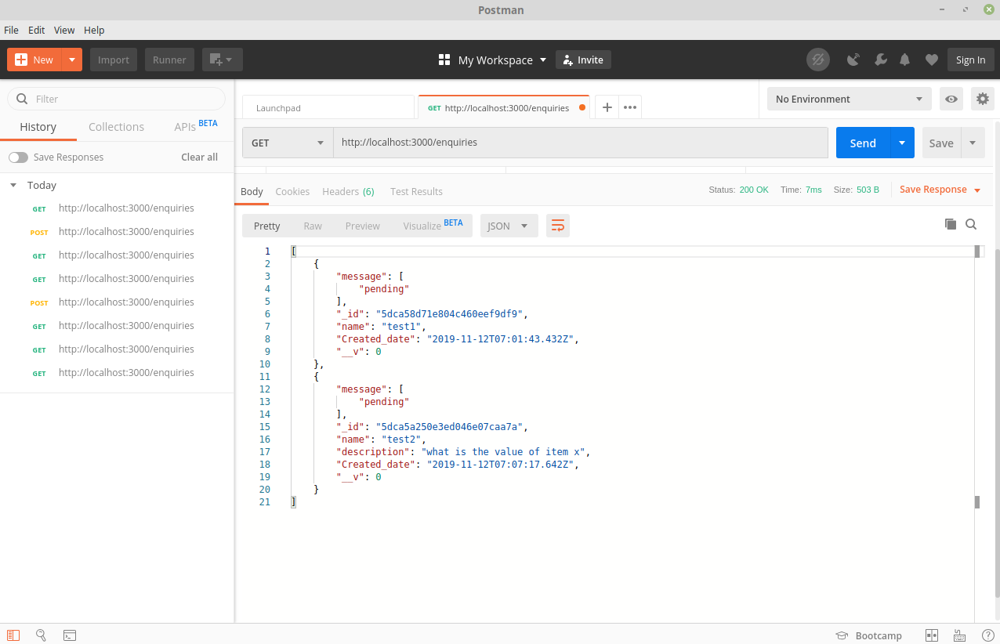
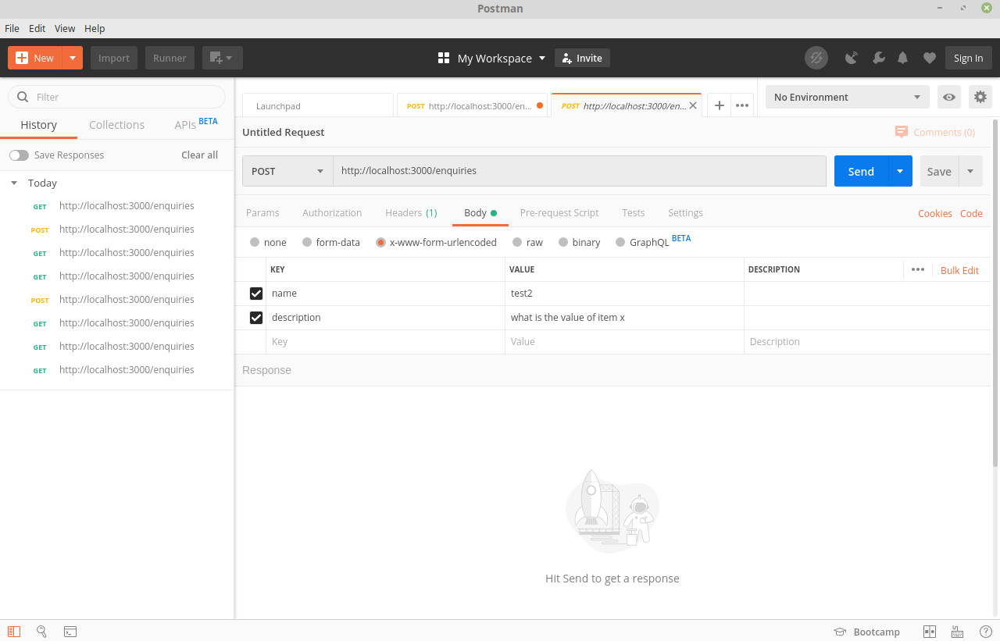
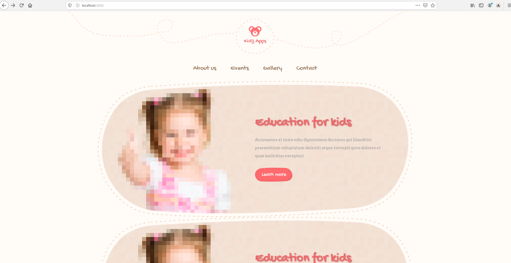
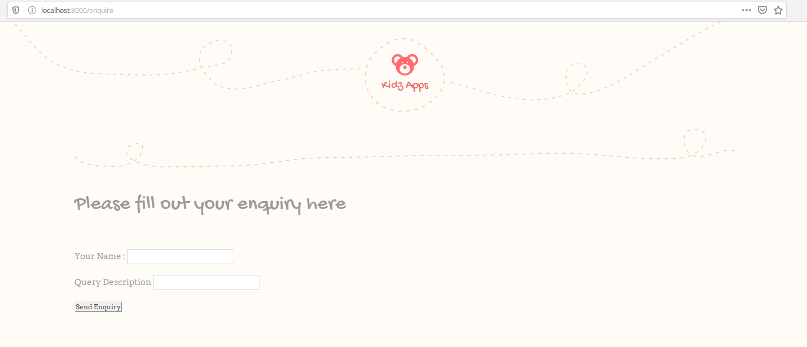
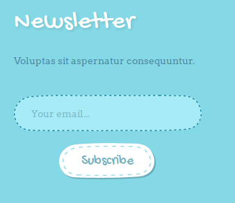

# Activity 3

The activity deals with creating a website for accepting enquiries and orders

The project has been created in nodejs. For ease of development, a linux (Ubuntu) Environment has been used. The same is preffered for deployment and testing purposes. However a Windows Environment may also be used. The tutorial / deployment guide is specific to linux.

Things you'll need:

* [Node.js](https://nodejs.org)
* [Mongo Db](https://www.mongodb.com/download-center/community)
* Postman

```bash
sudo snap install postman
```

* [VSCode](https://code.visualstudio.com/Download) has been used as the choice of development environment, however the requirement for vscode workspace file was not felt, so the same has not been included.

## Deployment

* Install mongodb and start it
* test installation by running mongo and you should see a mongo terminal
* goto the project directory

```bash
cd <path to activity-3 folder>
```

* start the website

```bash
npm start
```

* You should see the output like

```console
[nodemon] 1.19.4
[nodemon] to restart at any time, enter `rs`
[nodemon] watching dir(s): *.*
[nodemon] watching extensions: js,mjs,json
[nodemon] starting `node server.js`
Web Service started on: 3000

(Igonre any depication warnings thrown by mongodb)
```

## Usage

* To insert data using the web service, open postman, select post from the dropdown, select the body tab and x-www-form-urlencoded in the request type.

* To visit the website, open a browser and visit http://localhost:3000/

## Features for activity - 3

* The website uses the following features :

1. Web services
2. Enquiry form
3. Newsletter - The feature has not been integrated but the same can be used for digital marketing
4. JPEG - Digital marketing

## Screenshots


*Postman output to show that the Web service is working and responding with json data*


*Postman screenshot to insert data into the database using webservice*


*Website Landing Page*


*Enquiry Page*


*Newsletter*

## Online Resources

* [Tutorial for creating webservice](https://www.codementor.io/olatundegaruba/nodejs-restful-apis-in-10-minutes-q0sgsfhbd)
